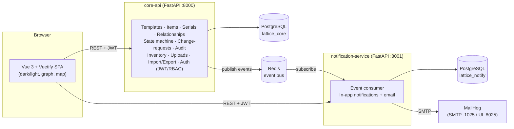

# Lattice — רכיב

**Hierarchical hardware asset tracking for setups (סטאפים), assemblies (מכלולים) and cards (כרטיסים) — every item made from a template.**

Lattice doesn't just list parts — it manages the *relationships* between them. It
knows, at any moment, which card is assembled inside which assembly inside which
setup (and, if a card isn't assembled, where it physically sits and its
operational state). Moving a container drags everything inside it; every change
is audited; and edits by non-managers go through a manager-approval workflow.

> Built with **FastAPI** (Python, uv monorepo, microservices) + **Vue 3 / Vuetify**,
> two PostgreSQL databases, Redis, and email — all wired together with **Docker Compose**.

---

## Architecture



Two services, two databases, one event bus. The **core-api** owns the domain and
publishes domain events; the **notification-service** consumes them and fans them
out to in-app notifications and email. Both validate the same JWT, so the
frontend talks to each directly. Shared code (config patterns, the typed event
bus) lives in the `lattice-shared` workspace package.

### Tech
- **Backend:** Python 3.12+, FastAPI, SQLAlchemy 2.0, Pydantic v2, managed as a **uv workspace (monorepo)**.
- **Frontend:** Vue 3 (`<script setup>`, TypeScript), Vuetify 3 (light/dark + 8 pastel themes), Pinia, Vue Router, vis-network (graphs), custom SVG floor-plan.
- **Database:** schema owned by **Alembic** migrations (applied on start-up); a pre-migration database is converted once (see `legacy_upgrade.py`).
- **Infra:** PostgreSQL ×2, Redis (pub/sub), MailHog (email capture), Docker Compose.
- **Config:** `.env` / dotenv everywhere (`.env.example` provided).

---

## Quick start (Docker Compose)

```bash
cp .env.example .env         # optional: tweak secrets/ports
docker compose up --build
```

Then open:

| URL | What |
|-----|------|
| http://localhost:8080 | **Lattice web app** |
| http://localhost:8000/docs | core-api OpenAPI (Swagger) |
| http://localhost:8001/docs | notification-service OpenAPI |
| http://localhost:8025 | MailHog — see the emails the system sends |

### First sign-in

The system starts **empty** — no projects, locations, items or floor plan. On
first boot the core-api creates its schema and exactly one account, the
bootstrap administrator:

| Email | Password | Role |
|-------|----------|------|
| `admin@lattice.io` | `admin1234` | manager |

Both are configurable (`BOOTSTRAP_ADMIN_EMAIL` / `BOOTSTRAP_ADMIN_PASSWORD`) and
the password should be changed at once. Everything after that is created in the
app — **[`docs/USER_GUIDE.md`](docs/USER_GUIDE.md) walks through it in order**,
from the first project value to the first low-stock alert.

### Upgrading an existing installation

On start-up the API brings the database to the latest Alembic revision. A
database created by an earlier, pre-migration release is detected and
converted **once, in a single transaction** (nothing changes if any step
fails): each distinct item name becomes a template, items keep their ids and
get serials in the new `C/A/S-XXX-###` scheme (the old serial is kept in a
*Legacy serial* field), states and card types are mapped to the new values,
locations holding desiccator cards join the desiccator, and pending change
requests are closed with a note asking for resubmission (their payloads
describe the old format). Back up the database first, as with any upgrade.

The sign-in screen can offer accounts as one-click shortcuts. That list is
**data, not code**: a manager publishes each account (and optionally its
password) under *Users & Permissions*. A fresh system publishes none, so the
section is simply absent until someone opts in — anything published is served
unauthenticated, which is what that screen is for.

---

## Local development (without Docker)

Backend (uv):
```bash
uv sync --all-packages
# core-api (defaults to a local SQLite file, no Postgres needed):
uv run uvicorn lattice_core.main:app --reload --port 8000
# notification-service:
uv run uvicorn lattice_notifications.main:app --reload --port 8001
```

Frontend:
```bash
cd frontend
npm install
npm run dev        # http://localhost:5173
```

### Tests
```bash
uv run pytest services/core-api/tests -q             # core API (SQLite)
LATTICE_TEST_DATABASE_URL=postgresql+psycopg://user@host/emptydb \
  uv run pytest services/core-api/tests -q             # …or against an empty Postgres
uv run pytest services/notification-service/tests -q  # notifications
uv run ruff check services packages                   # lint
(cd frontend && npm run typecheck && npm run build)   # frontend
```

### Database migrations
```bash
# after changing models.py:
uv run alembic -c services/core-api/alembic.ini revision --autogenerate -m "what changed"
uv run alembic -c services/core-api/alembic.ini upgrade head   # the API also does this on start-up
```

---

## Requirements → implementation map

| Requirement | Where |
|-------------|-------|
| Item types: setups / assemblies / cards; card types copied / house / white / factory / commercial | `models.ItemType`, `models.CardType`; one `items` table, self-referential `parent_id` |
| **Every item is created from a template**; one template per named card / assembly / setup | `models.ItemTemplate`, `services/templates.py`, `services/items.py:create_item` (`template_id` required) |
| Template fields: fixed (white) / list (white ▾, first = default) / per item (grey), required (★), formats `XX-#####`, all field types | `models.TemplateField` (`FieldType`, `FieldMode`), `services/fields.py` |
| Template edits apply to every item made from it (e.g. new manager → all items) | `services/templates.py:update_template` (read-through + propagation) |
| Which templates may sit inside which (cards in assemblies, assemblies/cards in setups) | `template_children`; enforced by `services/items.py:validate_link` |
| Serials `C/A/S-XXX-###`: prefix from the template, number = highest + 1, editable, no duplicates | `services/serials.py`; unique index on `items.serial` |
| States built / ok / faulty / destroyed (built by default) | `models.ItemState`, `services/items.py:change_state` |
| Team catalog; two-way many-to-many links between team, industry and project | `CatalogCategory.team`, `models.CatalogLink`, `services/catalog.py`, `PUT /catalog/{id}/links` |
| Viewers may propose a location change; editors propose item and template changes | `services/change_requests.py` (`_ALLOWED_ACTIONS`) |
| Lists grouped by template with per-status counts; a template's units with state, location, parent, serial | `GET /templates` (`counts`), `GET /items?template_id=`, `TemplateGroupsView.vue` |
| Real document uploads | `models.Document` (`storage_key`), `services/files.py`, `/uploads`, `/documents/{id}/download` |
| Desiccator = a set of locations (Catalog → Desiccator); stock thresholds on built/ok cards in it | `Location.is_desiccator`, `PUT /locations/desiccator`, `services/inventory.py` |
| Hierarchy graph by templates, all trees of a template, one item's tree | `routers/graph.py`, `HierarchyGraph.vue`, `GraphPage.vue`, item page → Hierarchy |
| Map 100 × 100 floor-plan | `FloorPlanMap.vue` |
| Audit: my items only, 6 months / year / all time, Excel export | `routers/audit.py` |
| Notifications: all / unread / read | notification-service `GET /notifications?status=` |
| Excel import per template (headers = creation fields), all-or-nothing with per-cell errors; export | `services/importexport.py` |
| Change-approval workflow, audit log, managers per item, low-stock alerts, dark/light/pastel themes, RTL Hebrew | as before (`change_requests.py`, `audit.py`, `inventory.py`, `plugins/themes.ts`, `i18n/`) |

The full HTTP + event contract is in [`docs/CONTRACT.md`](docs/CONTRACT.md).

---

## Project layout

```
lattice/
├── docker-compose.yml          # full dev stack
├── pyproject.toml              # uv workspace root
├── .env.example
├── docs/
│   ├── CONTRACT.md             # shared API + event contract
│   └── USER_GUIDE.md           # how to actually use the system (Hebrew)
├── packages/
│   └── lattice-shared/           # shared config + typed Redis event bus
├── services/
│   ├── core-api/               # FastAPI: templates, items, workflow, inventory, audit
│   │   ├── alembic.ini
│   │   ├── src/lattice_core/{models,schemas,services,routers,…}.py
│   │   ├── src/lattice_core/migrations/   # Alembic revisions (applied on start-up)
│   │   └── tests/
│   └── notification-service/   # FastAPI: event consumer → in-app + email
│       ├── src/lattice_notifications/
│       └── tests/
└── frontend/                   # Vue 3 + Vuetify SPA
```

---

## Design notes / decisions

- **Templates are the model; items are units.** A template owns the name, the
  card type, the serial prefix and the field list; items reference it by FK
  (`RESTRICT`, so a template with items can't vanish). Items of one template
  share its name and differ by serial — which is what makes the grouped list
  pages and per-template stock possible.
- **Fixed values are read through, not copied.** A white field's value lives on
  the template, so editing it changes every item at once. Values other tables
  depend on — catalog values, users, location, parent, state, quantity — are
  real foreign-key columns on `items` (or `item_managers`), and a template edit
  rewrites them in the same transaction. Free-form values go to
  `item_field_values` (one row per item × field, unique).
- **Integrity in the database, explanations in the service.** Unique serials,
  unique (type, name) and (type, prefix) per template, ordered pairs for
  catalog links, `quantity ≥ 1`, card type only on card templates — all are
  constraints; the services check first so the user gets a sentence, not an
  integrity error.
- **Nothing derived is stored.** Storage status (assembled / in use /
  desiccator) follows from the parent and the location's `is_desiccator`, so
  redefining the desiccator instantly reclassifies every card.
- **Enums are checked VARCHARs.** Native PostgreSQL enums can't drop or rename a
  value inside a migration; a named CHECK constraint gives the same integrity
  and evolves with one statement.
- **Migrations, not `create_all`.** Alembic owns the schema and the API upgrades
  on start-up. Databases from before migrations are converted once by
  `legacy_upgrade.py`, in one transaction (roll back on any failure).
- **Location cascade is strictly downward**, and a linked item has no location
  of its own (move the container, or unlink first).
- **Mutations live in one place** (`services/*.py`). Managers call them
  directly; approved change requests call the same functions.
- **Ships empty.** `seed.py` creates the bootstrap admin and nothing else; the
  world the tests read is built by their own fixtures.
- **Notifications are best-effort and decoupled** (Redis pub/sub; mail outages
  never break the API). Low-stock alerts are one digest per recipient with a
  structured `payload.components[]`.
