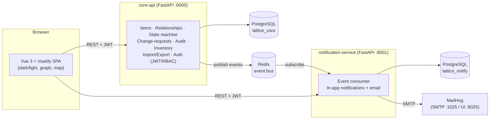

# Lattice — רכיב

**Hierarchical hardware asset tracking for setups (סטאפים), assemblies (מכלולים) and cards (כרטיסים).**

Lattice doesn't just list parts — it manages the *relationships* between them. It
knows, at any moment, which card is assembled inside which assembly inside which
setup (and, if a card isn't assembled, where it physically sits and its
operational state). Moving a container drags everything inside it; every change
is audited; and edits by non-managers go through a manager-approval workflow.

> Built with **FastAPI** (Python, uv monorepo, microservices) + **Vue 3 / Vuetify**,
> two PostgreSQL databases, Redis, and email — all wired together with **Docker Compose**.

---

## Architecture



Two services, two databases, one event bus. The **core-api** owns the domain and
publishes domain events; the **notification-service** consumes them and fans them
out to in-app notifications and email. Both validate the same JWT, so the
frontend talks to each directly. Shared code (config patterns, the typed event
bus) lives in the `lattice-shared` workspace package.

### Tech
- **Backend:** Python 3.12+, FastAPI, SQLAlchemy 2.0, Pydantic v2, managed as a **uv workspace (monorepo)**.
- **Frontend:** Vue 3 (`<script setup>`, TypeScript), Vuetify 3, Pinia, Vue Router, vis-network (graph), custom SVG floor-plan (map).
- **Infra:** PostgreSQL ×2, Redis (pub/sub), MailHog (email capture), Docker Compose.
- **Config:** `.env` / dotenv everywhere (`.env.example` provided).

---

## Quick start (Docker Compose)

```bash
cp .env.example .env         # optional: tweak secrets/ports
docker compose up --build
```

Then open:

| URL | What |
|-----|------|
| http://localhost:8080 | **Lattice web app** |
| http://localhost:8000/docs | core-api OpenAPI (Swagger) |
| http://localhost:8001/docs | notification-service OpenAPI |
| http://localhost:8025 | MailHog — see the emails the system sends |

The core-api creates its schema and seeds an admin + demo data on first boot.

### Demo logins

The sign-in screen offers these as one-click shortcuts. That list is **data, not
code**: a manager toggles each account (and whether its password is pre-filled)
under *Users & Permissions*, and with none published the section disappears
entirely. Anything published is served unauthenticated — that is the point of
the screen, and the reason nothing is published by default outside the demo seed.

| Email | Password | Role | Notes |
|-------|----------|------|-------|
| `admin@lattice.io` | `admin1234` | manager | bootstrap admin |
| `noa@lattice.io` | `password` | manager | linked to the demo setup (gets its approvals) |
| `dana@lattice.io` | `password` | editor | proposes changes for approval |
| `amir@lattice.io` | `password` | viewer | read-only |

Try this end-to-end: log in as **Dana** (editor), propose a change to the Falcon
setup → log in as **Noa** (manager), see the notification + the MailHog email,
approve it → watch the change apply and the audit log update.

---

## Local development (without Docker)

Backend (uv):
```bash
uv sync --all-packages
# core-api (defaults to a local SQLite file, no Postgres needed):
uv run uvicorn lattice_core.main:app --reload --port 8000
# notification-service:
uv run uvicorn lattice_notifications.main:app --reload --port 8001
```

Frontend:
```bash
cd frontend
npm install
npm run dev        # http://localhost:5173
```

### Tests
```bash
uv run pytest services/core-api/tests -q            # core API (52 tests)
uv run pytest services/notification-service/tests -q # notifications (9 tests)
uv run ruff check services packages                  # lint
```

---

## Requirements → implementation map

| # | Requirement | Where |
|---|-------------|-------|
| §2 | Item types: setups / assemblies / cards; commercial / company / unique cards; "linking" vs "linked" | `models.py` (`Item`, `ItemType`, `CardType`, `CardTracking`), self-referential `parent_id`; unique names + per-card-type rules in `services/items.py` |
| §3 | Link card→assembly/setup, assembly→setup; **moving a container cascades location to its contents**, moving a contained item does not | `services/items.py: move_item` (downward cascade), `link_item`/`validate_link` (allowed pairs) |
| §4 | Bidirectional navigation between linked items | `ItemOut.parent` + `ItemOut.children` (clickable both ways in the UI) |
| §5 | Setups: name, industry, project, location, team, **state + history**, description, DAMATZ (דמ"צ), linked items, extra non-card items (part no. / serial / signed-by) | `Item`, `ExtraItem`, `StateHistory` |
| §6 | Assemblies: same documentation + shows parent setup | `Item` (+ `parent` link) |
| §7 | Cards: responsible, lead, production date, version, location, state+history, linked setups/assemblies, documents; count **in-use vs desiccator** | `Item` card fields, `Document`, `StorageStatus`, `/inventory/summary` (all figures are unit sums) |
| §8 | Permissions: viewer / editor / manager; managers also choose **which accounts (and whether their passwords) appear as shortcuts on the sign-in screen** | `models.UserRole`, `deps.py` role guards, `/users`, `User.login_hint_*`, `GET /auth/login-hints` |
| §9 | Change-approval workflow: editor proposes (with description + reason) → managers notified (email + in-app) → approve → apply. Items can be **linked to specific managers** for targeted routing | `models.ChangeRequest`, `services/change_requests.py`, `item_managers` table |
| §10 | Change log per item; manager log of changes on their linked items over day/week/month | `models.AuditLog`, `/audit`, `/audit/my-items?period=` |
| §11 | Excel import (bulk) & export | `services/importexport.py`, `/data/{template,import,export}` |
| §12 | Desiccator stock: **an explicit quantity per commercial card**, breakdown by version & production date, per-serial for serialised cards; **minimum-quantity alerts** listing the short components (email + in-app to manager & editor) | `services/inventory.py`, `Item.quantity`, `StockThreshold`, `/inventory/{cards,desiccator,thresholds,low-stock}` |
| Extras | Hierarchy **graph** page, **editable floor-plan map** (draw/move/resize buildings behind the location markers), **dark/light** mode | `/graph`, `/locations` (x,y), `/map/buildings`, frontend |

The full HTTP + event contract is in [`docs/CONTRACT.md`](docs/CONTRACT.md).

---

## Project layout

```
lattice/
├── docker-compose.yml          # full dev stack
├── pyproject.toml              # uv workspace root
├── .env.example
├── docs/CONTRACT.md            # shared API + event contract
├── packages/
│   └── lattice-shared/           # shared config + typed Redis event bus
├── services/
│   ├── core-api/               # FastAPI: domain, auth, workflow, inventory, audit
│   │   ├── src/lattice_core/{models,schemas,services,routers,…}.py
│   │   └── tests/
│   └── notification-service/   # FastAPI: event consumer → in-app + email
│       ├── src/lattice_notifications/
│       └── tests/
└── frontend/                   # Vue 3 + Vuetify SPA
```

---

## Design notes / decisions

- **One `items` table, three types.** Setups, assemblies and cards share most
  documentation and, crucially, a single self-referential tree (`parent_id`).
  That makes "which card is in which setup" a graph walk, and makes the
  cascade-on-move rule a single downward traversal.
- **Location cascade is strictly downward.** Moving an item updates it and all
  descendants; it never touches ancestors — exactly matching §3.
- **Two kinds of card, counted two ways.** A *commercial* card is a quantity of
  interchangeable parts on a single row (`Item.quantity`, no serial); a
  *company*/*unique* card is one row per physical board with a mandatory,
  globally unique serial. Every stock figure is `SUM(quantity)` — serialised
  cards pin it to 1, so one formula serves both — and each inventory group
  reports *how* it was counted (`tracking`, `records`, `serials[]`) so a number
  can always be explained. Bulk Excel import handles large batches of either.
- **A name identifies one thing.** Live setups, assemblies and commercial cards
  can't share a name (trimmed, case-insensitive). Serialised cards are the
  deliberate exception: twenty boards off one run are twenty rows of the same
  model, and the serial is what tells them apart.
- **Mutations live in one place** (`services/items.py`). Managers call them
  directly; editors' change-requests call the *same* functions on approval — so
  the rules (link validity, fault-note requirement, cascade, audit) can't drift.
- **Notifications are best-effort and decoupled.** core-api publishes to Redis
  and never blocks on it; the consumer is resilient (reconnect w/ backoff, email
  failures swallowed) so a mail outage never breaks the API.
- **Alerts carry data, not prose.** A low-stock alert is one digest per
  recipient listing exactly the components they own, as a structured
  `payload.components[]` the UI renders as a table (the text body mirrors it for
  email) — rather than one sentence-shaped email per threshold.
